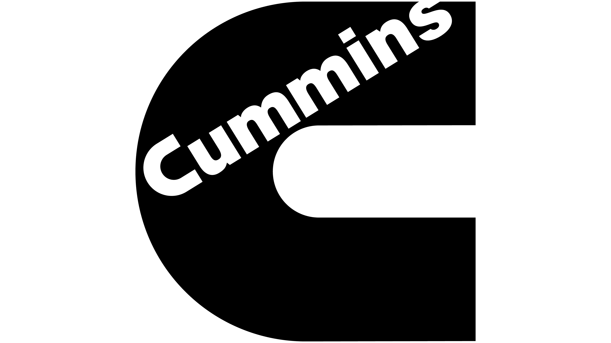

Stress Group, Midrange Engineering, Cummins Inc
Senior Structural Analyst

Mar ’10 - Present
 Responsible for lubrication & cooling components, and cylinder block validation for 2013 B and L
engine families, and current product support for all B, C and L engine families
 Analytical Work
o Performed FE analyses using ANSYS Classic & Workbench 12.1; modal analyses, structural
analyses subject to non-linear material properties, contacts, large displacements, and gaskets
o Developed calibrated FE models to predict / understand on-engine failures, and formulate
solutions using analysis-led-design methods
o Developed 1-D hot bolted joints tool to predict load loss of exhaust manifold capscrews at
elevated temperatures
o Guided analysts in off-shore location (Cummins Research and Technology India)
 Experimental Work
o Performed on-engine strain & acceleration based validation of engine components (Frequently
used tools: Waterfall plots, FFTs, Overall Levels, digital filters, Modified Goodman Plots,
Reliability calculations etc.). Used FE results to decide strain gage and accelerometer locations.
o Conducted ultrasonic bolted load testing, using MicroControl MC900 transient recorder,
MC911 software to quantify cold relaxations, thermal relaxations, assembly loads etc.
o Quantified gasket sealing pressure distributions using pressure sensitive paper (Prescale Fujifilm
paper)
o Determined fatigue properties using resonant dwell and staircase fatigue methods on shakers
o Measured friction coefficients and strengths for bolts using Torque-Tension & MTS machines
 Capability Development
o Developed Functional Excellence Processes for analytical & experimental validation of
turbocharger oil drain tubes
o Developed processes for standardization of analysis and documentation of oil & coolant lines, to
drive efficiency, consistency and quality
o Responsible for identification of opportunities for process and capability improvement, and
execution of projects to drive continuous improvement
o Led turbocharger stud capability; which resulted in quantification of cold joint measurement
error across facilities, and determination of high temperature material properties
Midrange Customer Engineering, Cummins Inc
Current Product Validation Engineer

Jan ’08 – Mar ’10
 Managed multiple engineering projects each dealing with reducing high warranty costs on
Customer Engineering component/subsystem
 Lead geographically diverse teams of designers, analysts, service & quality engineers, personnel at
distribution centers & manufacturing plants, as well as external suppliers & contractors, to solve
major product problems
 Utilized Fault Tree Analysis method to identify potential root causes of component failure, carried
out numerical analysis (FE analysis, Dimensional Variational Analysis), design of experiments,
reviewed metallurgical reports, metrological reports, supplier capability reports, conducted in-field
testing etc to narrow down and identify key root causes to product failure
 Chaired meetings with Korean & Japanese counterparts; Was responsible for Hyundai Heavy
Industries’ engineering account for warrantable failures

University of Michigan Recruiting Team
 Represented Cummins at career fairs and information sessions
 Conducted on-campus interviews for internships and full time positions