At 19, I received a letter that felt like a launchpad: I’d been selected for the [Kishore Vaigyanik Protsahan Yojana (KVPY)]{.mplink url="https://www.indiascienceandtechnology.gov.in/programme-schemes/human-resource-and-development/kishore-vaigyanik-protsahan-yojana-kvpy"} scholarship, a prestigious program to nurture India’s young scientific talent. It was my ticket to IIT Bombay’s Aerospace Engineering Department, where I joined [Prof. R. K. Pant’s team]{.mplink url="https://www.aero.iitb.ac.in/~rkpant/"} to build remotely operated airships—innovative, lighter-than-air vehicles with the potential to transform transport and surveillance, all crafted indigenously in India.

::: {.column-margin}
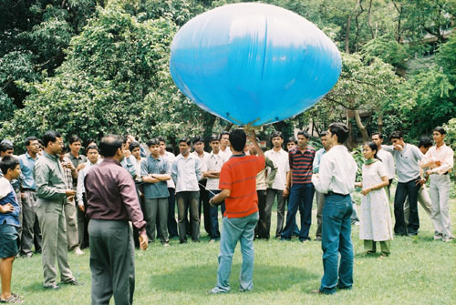
:::

In the summer of 2004, I dove into the Lighter-Than-Air (LTA) Systems Laboratory as part of the [Program on Airship Design & Development (PADD)]{.mplink url="https://www.aero.iitb.ac.in/~airships/WEBPAGES/team.html"} team. My role? Designing and fabricating the envelope for a small indoor airship, a delicate yet critical component that had to balance lightweight materials with helium containment. But the real magic—and challenge—came in optimizing the hull’s aerodynamics. I spent countless late nights fueled by coffee, huddled over computers with teammates like Rohit and Kshitija. We were learning to set up meshes, define boundary conditions, and run computational fluid dynamics (CFD) simulations to calculate drag coefficients. Each simulation felt like a puzzle: one wrong setting, and the results were nonsense. But when we finally nailed it, watching the drag numbers align with our predictions was pure exhilaration.

Prof. Pant was our guiding star. He saw us for what we were—young, inexperienced, but brimming with potential. His patience was remarkable; he never rushed us, instead offering gentle nudges to keep us on track while encouraging us to explore. “An airship flies on ideas as much as helium,” he’d say, sparking our creativity. His mentorship taught me that innovation isn’t just about technical skill—it’s about curiosity, resilience, and trust in a team’s potential. I’ll never forget the moment our airship lifted off, hovering smoothly at 10 meters. It was a small victory, but to us, it felt like we’d conquered the sky.


:::: {.grid data-masonry='{ "itemSelector": ".grid-item", "gutter": 1 }'}
:::{.grid-item}
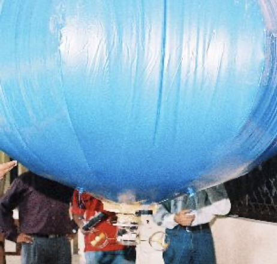{group='sketches'}
:::
:::{.grid-item}
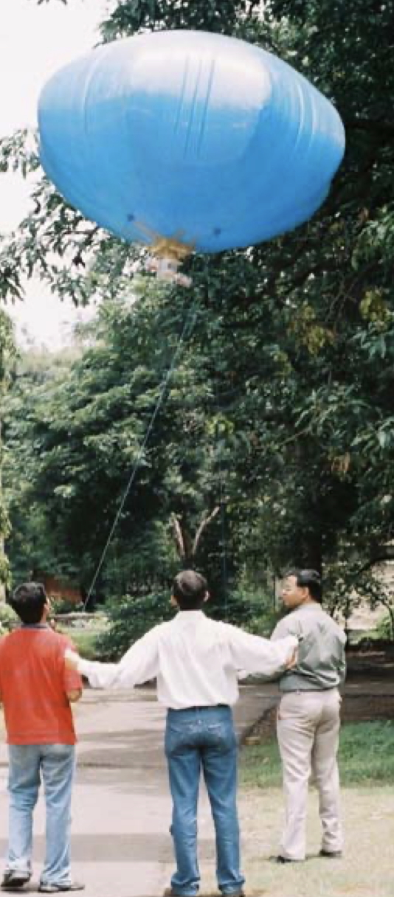{group='sketches'}
:::
:::{.grid-item}
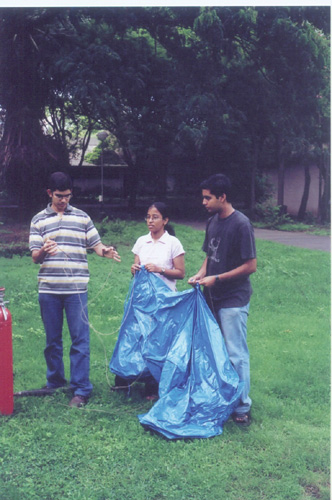{group='sketches'}
:::
:::{.grid-item}
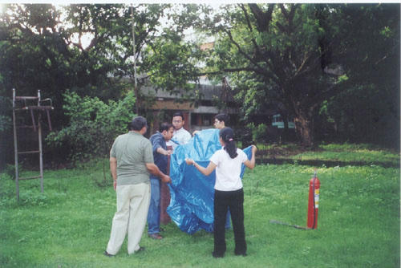{group='sketches'}
:::
:::{.grid-item}
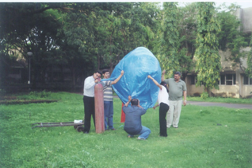{group='sketches'}
:::
:::{.grid-item}
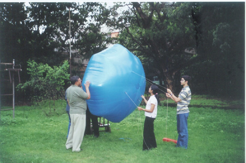{group='sketches'}
:::
:::{.grid-item}
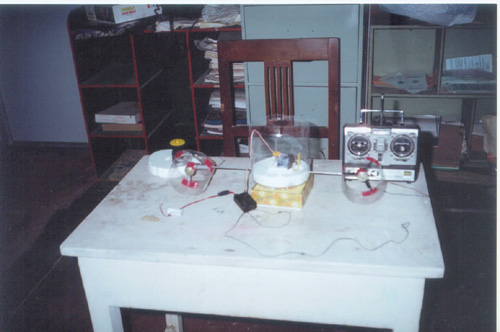{group='sketches'}
:::
:::{.grid-item}
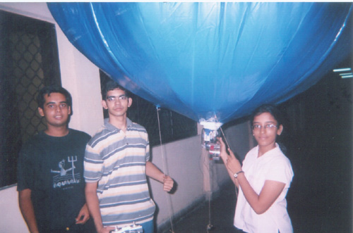{group='sketches'}
:::
:::{.grid-item}
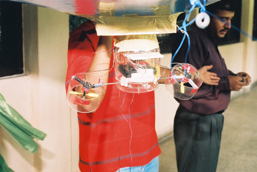{group='sketches'}
:::
:::{.grid-item}
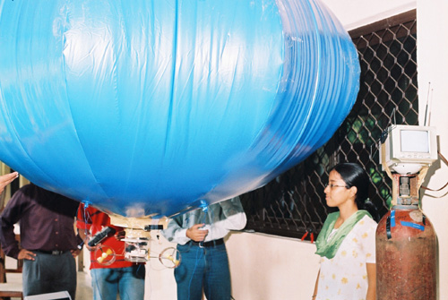{group='sketches'}
:::
:::{.grid-item}
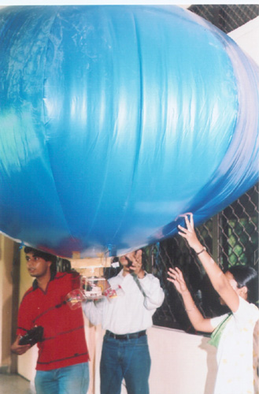{group='sketches'}
:::
:::{.grid-item}
{group='sketches'}
:::
:::{.grid-item}
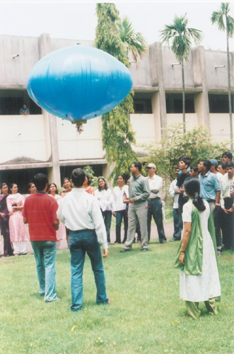{group='sketches'}
:::
:::{.grid-item}
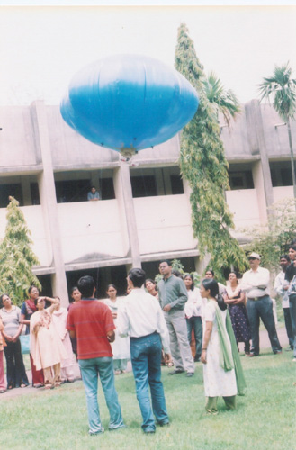{group='sketches'}
:::
:::{.grid-item}
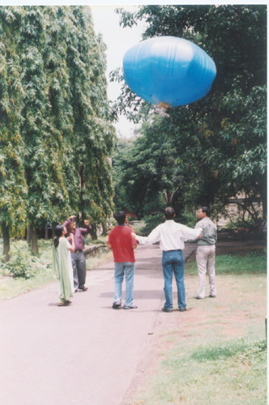{group='sketches'}
:::
::::

<!-- 
```{r}
img_files <- fs::dir_ls(here::here("career/iitb"), glob="*.jpg")
img_captions <- paste0("example-caption-0", seq_along(img_files))
cat(glue::glue("
  :::{{.grid-item}}
  {{group='sketches'}}
  :::"),
  sep = "\n"
)
``` 
-->


That KVPY summer wasn’t just about building airships. It was about building confidence, grit, and a passion for solving complex problems. Those late nights and Prof. Pant’s wisdom laid the foundation for my journey across industries, where I still chase the thrill of turning ideas into reality.
