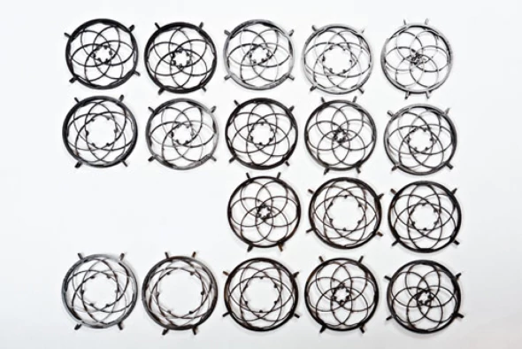

Compliant Systems Design Lab
Research Assistant

University of Michigan
Fall ’06 – Fall ’07

 Designed and modeled non-linear compact torsional springs using compliant members
 Developed algorithms to optimize geometry and material parameters using Matlab, ANSYS Classic
& Optimus to obtain any desired non-linear force – deflection behavior
 Generated a library of behavioral curves thru optimization & DOE for further research and
development
Engineering Research Center, National Institute of Science & Technology
Intern

Univ of Michigan
Summer ’07
 Developed a semiconductor factory network simulator to investigate IEEE 1588 time
synchronization techniques in distributed systems in industrial Ethernet
 Implemented modules handling data requests & reports in XML, JAXB complying with SEMI
standards. Achieved weekly goals in conjunction with a team in NIST, Maryland

Optimization of kinematic linkages of Caterpillar backhoe vehicle Winter ’07
 Generated mathematical model of kinematic behavior of digging mechanism & hydraulic actuator
system
 Performed multi-variable design optimization of power consumption by actuator sizing & selection
of actuator pin locations resulting in lower power consumption
Mechatronic Gauge for Piano Regulation (Patent in progress)
Client: Piano Technology Department, U of M School of Music

Winter ’07
 Designed & implemented a feedback control algorithm for constant velocity arm deflection and
reaction force calculation in C++, LabVIEW using optical encoders & OOPIC microcontrollers
 Surpassed expectations of client – 80% reduction in measurement time, 0.01 gm least count
achieved

Page | 3
PAPERS  ‘Precise Time Synchronization in Semiconductor Manufacturing’, Proceedings of the IEEE 1588

Conference, October 2007
 ‘Time synchronization for diagnostics and control in Ethernet-based applications’, Proceedings of
the American Controls Conference, June 2008