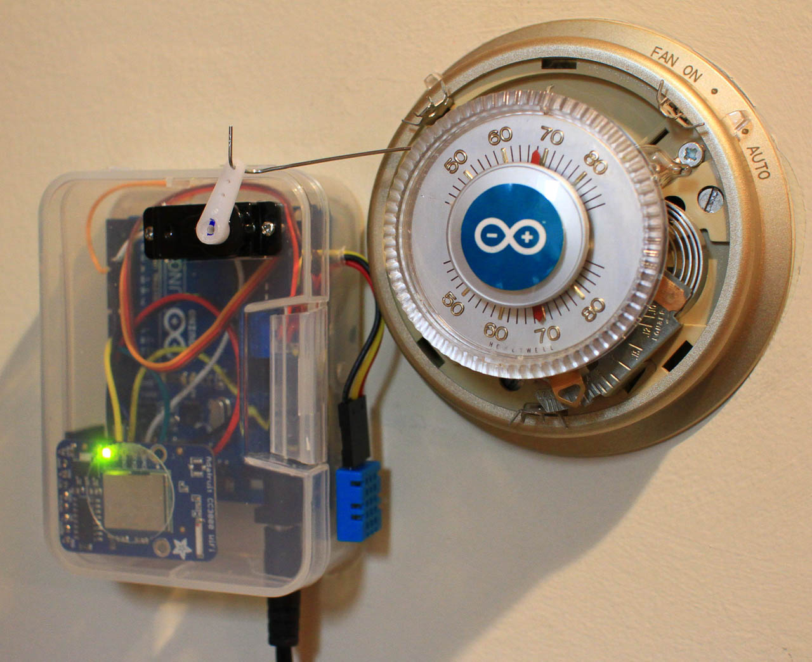
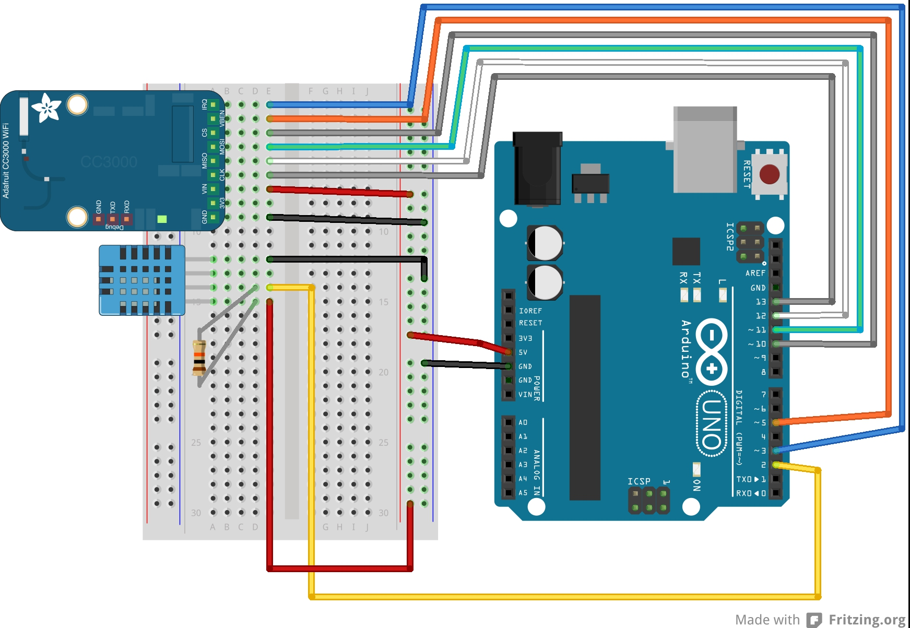
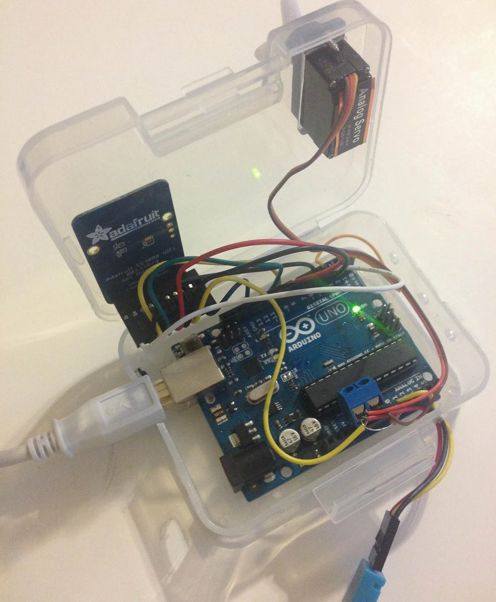
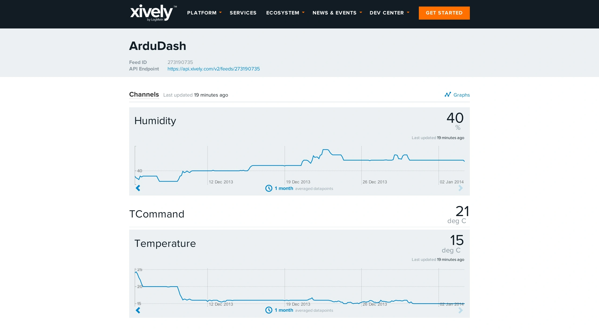
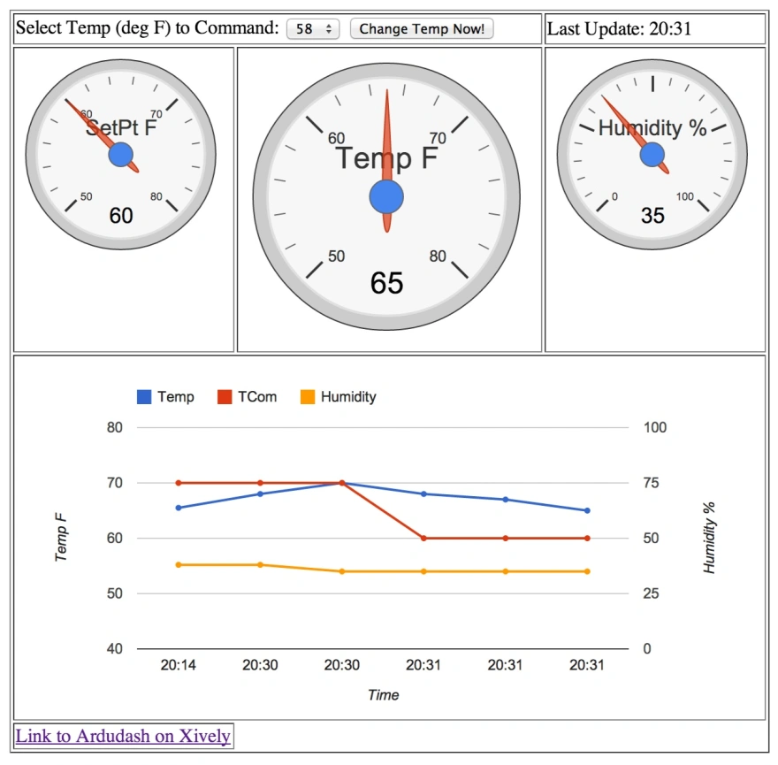
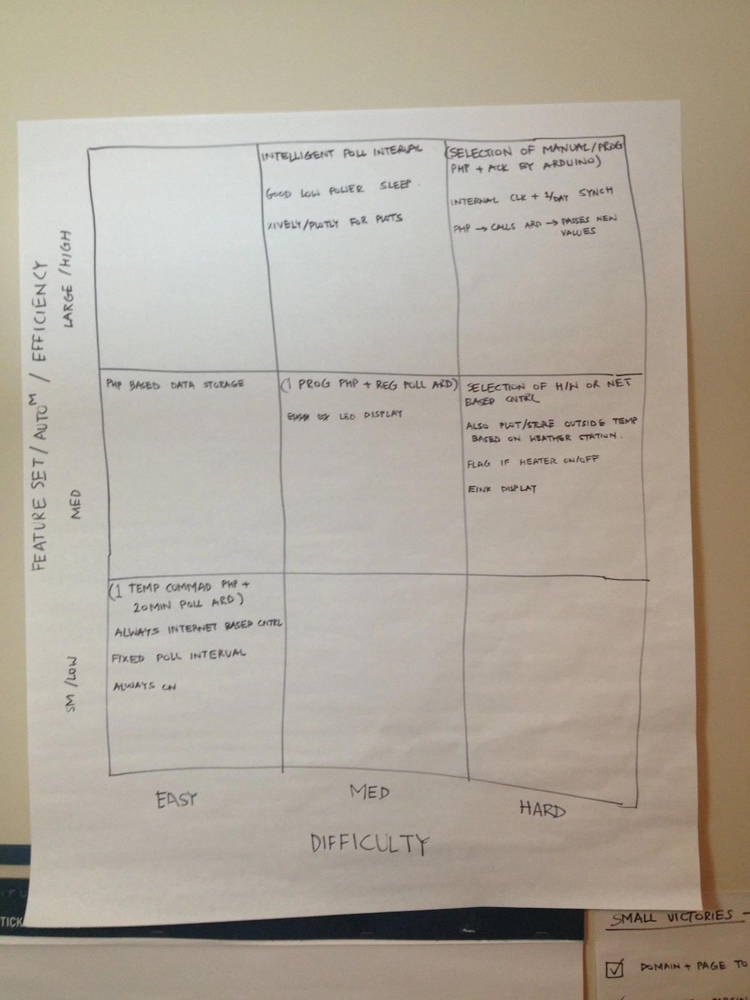

{width=50%}

### Overview

Last month I finally finished my first real Arduino project—a web-controlled thermostat. It's pretty much the "Hello World" of Arduino home automation projects, but hey, we all start somewhere.

### What's Inside

1. [Adafruit CC3000 WiFi Breakout Board](http://www.adafruit.com/products/1469)
2. Arduino Uno R3
3. Generic Hobby Servo Motor
4. 1 10k Resistor
5. 1 Paperclip (yes, really!)
6. 1 DHT11 Temperature Humidity Sensor

### Why Not Just Replace the Thermostat?

Since I've got a perfectly good Honeywell T87 thermostat and I'm renting (no major modifications allowed!), I decided to build a removable interface instead of going the more elegant relay route. Sometimes you gotta work with what you've got.

### Planning This Thing Out

I only had 3 days to go from idea to working hardware, so I had to be smart about it:

1. **Brainstormed** all the cool features I wanted
2. **Used a 9-box matrix** to plot features by difficulty vs. usefulness
3. **Started simple**: Focused on the "easy to implement" stuff first

The 9-box technique is actually pretty awesome for this kind of planning. Breaking everything into "small victories" made the whole project way less overwhelming.

### The Mechanical Challenge (AKA the Fun Part)

#### The Problem
How do you connect a servo to a thermostat without any proper tools or permanent modifications? This turned out to be way trickier than the electronics!

### My Options
1. Build a 4-bar linkage
2. Try some kind of belt/pulley system with rubber bands

### What Actually Worked
I went with the 4-bar linkage using a bent paperclip as the connecting rod. On the thermostat side, I MacGyvered a pin joint with a cotter pin setup. 

Here's the nerdy part: I actually photographed the whole assembly and used [ImageJ](http://rsb.info.nih.gov/ij/) to measure distances and angles. Turns out 50°F to 80°F on the stat is exactly 90° of rotation—perfect for servo control!

## The Software Side

### Web Stuff
I used 99k.org to host my HTML and PHP code. The setup is pretty straightforward:
- PHP generates a simple `tdata.html` file with the target temperature
- Arduino downloads and parses this file
- [Xively](https://xively.com/) handles the data plotting (super handy!)

## Learning the Hard Way

### Temperature Sensor Placement
Initially, I stuck the DHT sensor inside the plastic box. Big mistake! The thing was reading 3-4°C higher than actual temperature because of heat buildup. Moving it to the wall fixed that real quick.

### Fitting Everything In
Getting all the hardware crammed into that little box was like playing Tetris, but I managed to position everything so I could still access the USB and power ports without opening it up.

## See It in Action



## Round Two: Custom Dashboard

### Why I Switched from Xively
I wanted more control over my data visualization, so I built a custom dashboard with gauges for temperature, humidity, and target temp, plus historical charts.

### The Tech Stack
- **Database**: Free MySQL hosting on [zymic.com](http://zymic.com/)
- **Backend**: PHP to talk to the database
- **Frontend**: JavaScript with [Google Charts](https://developers.google.com/chart/)
- **Inspiration**: Shoutout to Fermentation Riot for the Google Charts idea

### Reality Check
I'm definitely not a web developer, so this was all copy-paste-modify from Stack Overflow and tutorials. Took me 2 solid days to get everything working, but if I can figure it out, anyone can!

## What's Next

- Scheduling based on time of day
- Manual controls on the thermostat itself
- Smarter polling intervals
- Upgrade to DHT22 for better accuracy

## Hard-Won Lessons

- Always use `servo.detach()` after moving the servo (prevents annoying flutter)
- Account for backlash in mechanical linkages—repeatability matters!

## Get the Code

Everything's on GitHub if you want to build your own: [https://github.com/rsangole/Arduino-Thermostat-Project](https://github.com/rsangole/Arduino-Thermostat-Project)

## Project Gallery

::: {layout-ncol=2}

{width=50%}

{width=50%}

{width=50%}

{width=50%}

{width=50%}

{width=50%}

:::