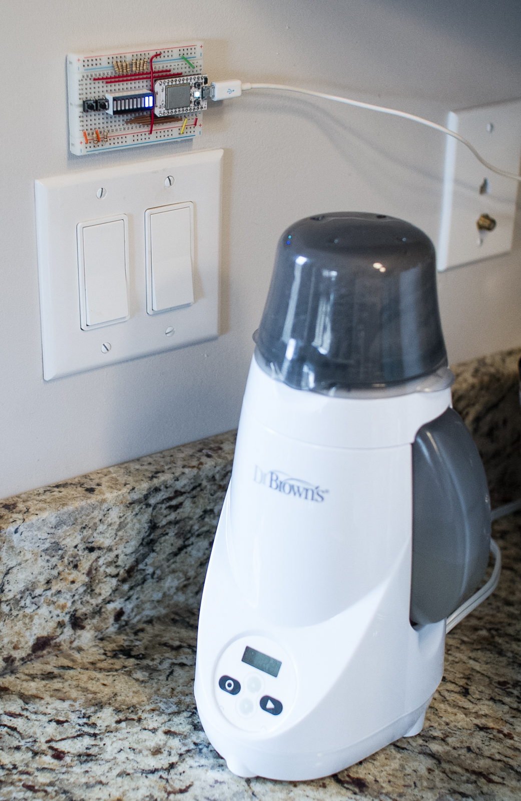
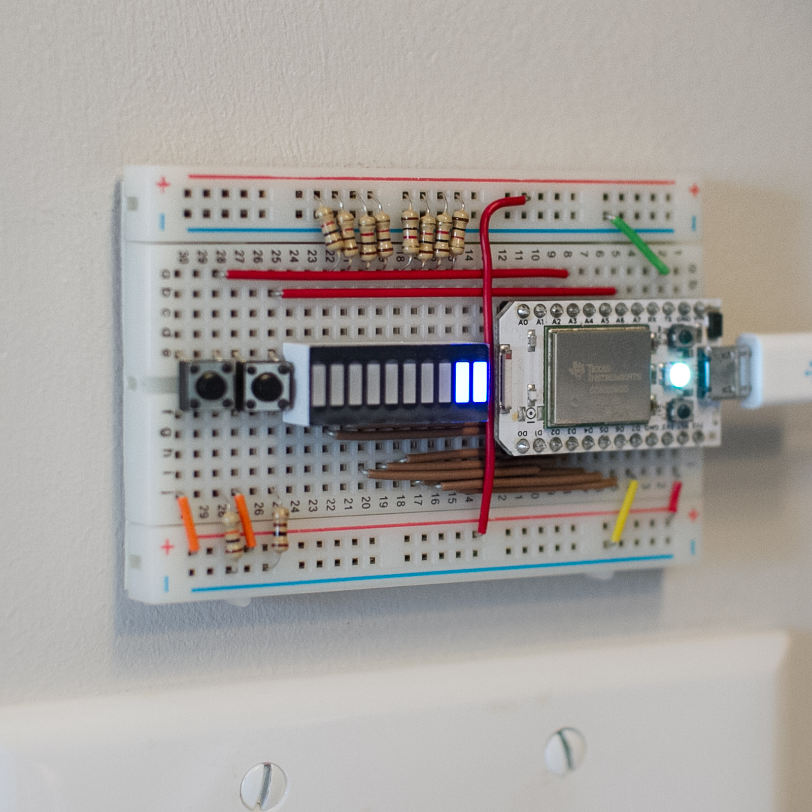
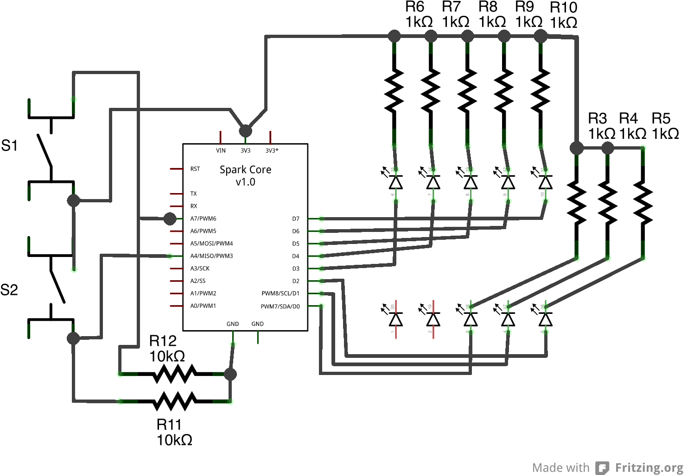

### The Problem

Maternity and paternity leaves are over; the parents are back to work. Baby is being fed via the bottle. Needless to say, this meant that we 'needed' an overengineering way to track his daily milk intake.

::: {.column-margin}
{width=50%}
:::

### The Solution

Thus, is born the wifi-enabled-twitter-feed-doodoo-tracker.

{width=50%}

The system is built around a Spark Core v1.0 microcontroller that connects to the internet via WiFi. The device features two main controls:

- **Switch S1**: Cycles through a 10-LED display, where each light represents 0.25 oz of milk consumed
- **Switch S2**: Sends the current milk intake data to the cloud

When S2 is pressed, the device transmits data through IFTTT (If This Then That) automation service, which then populates a secure Google Sheets spreadsheet. This allows parents to remotely monitor their baby's feeding schedule and milk consumption throughout the day, even while at work.

{width=50%}