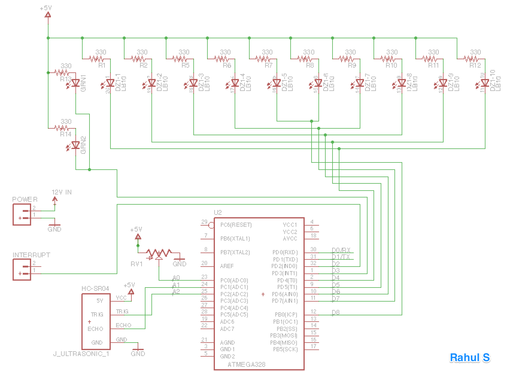
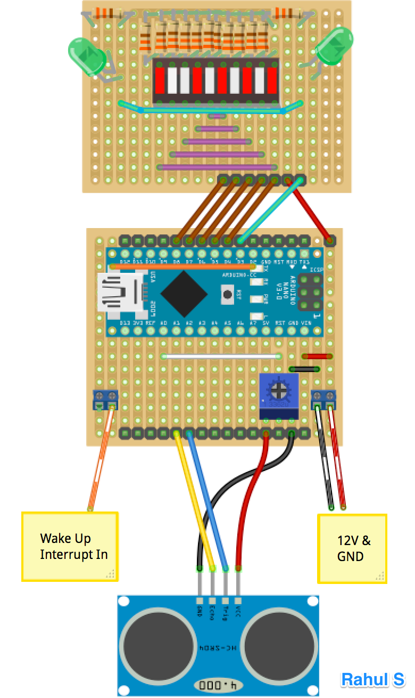
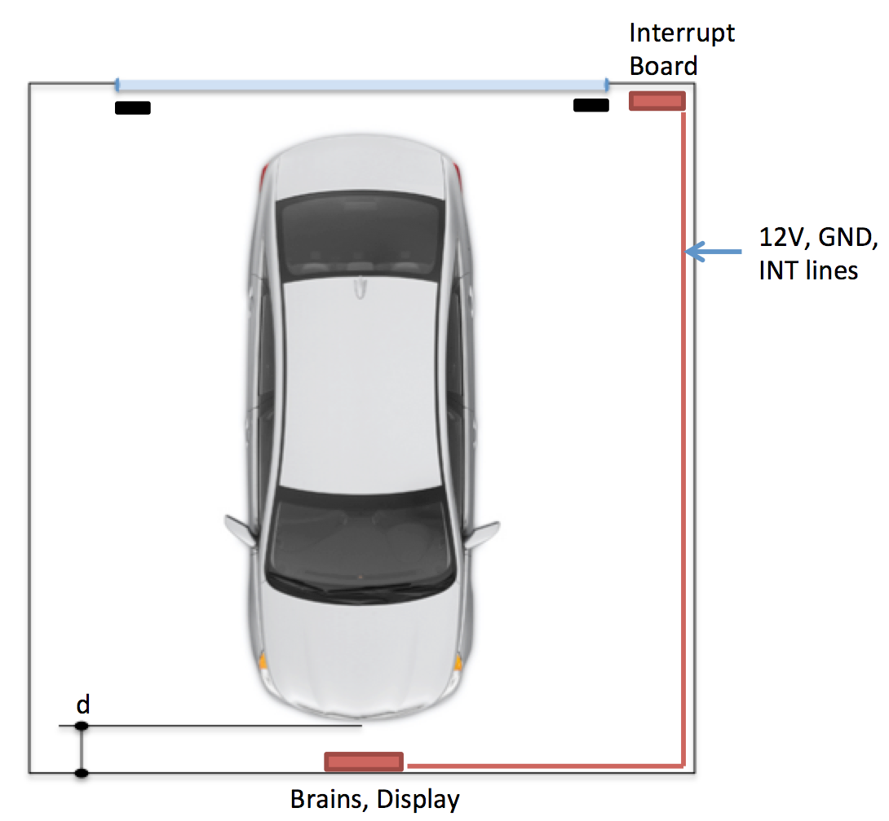
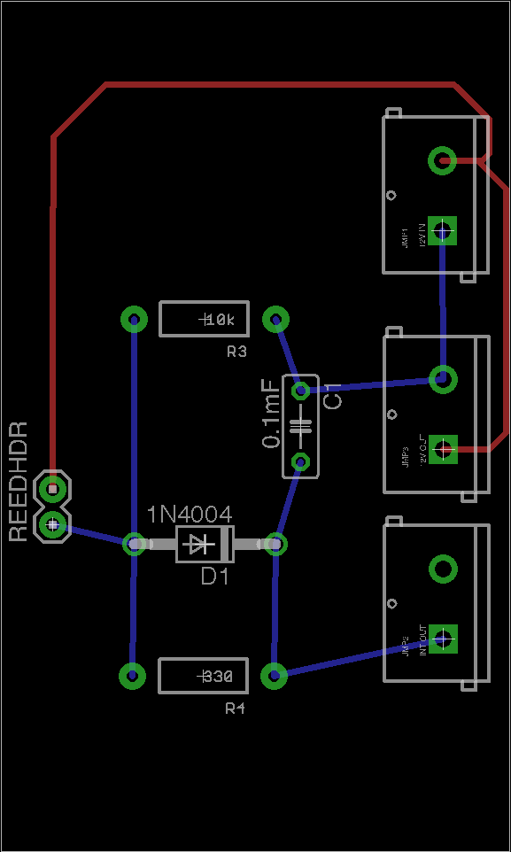
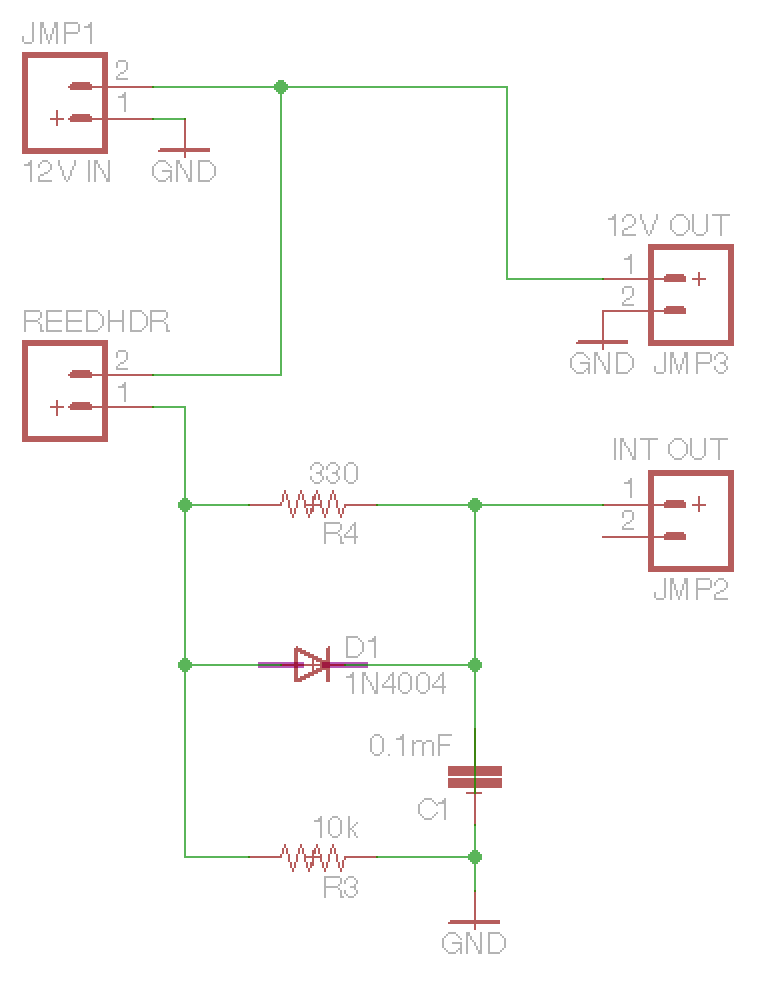
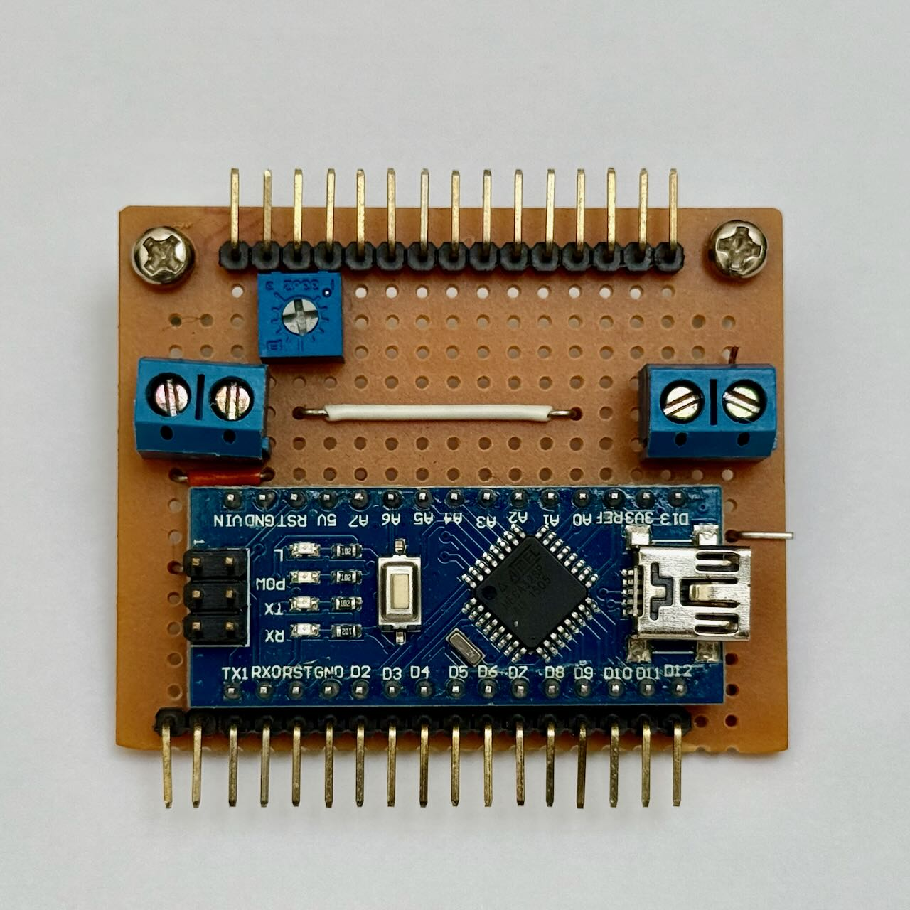
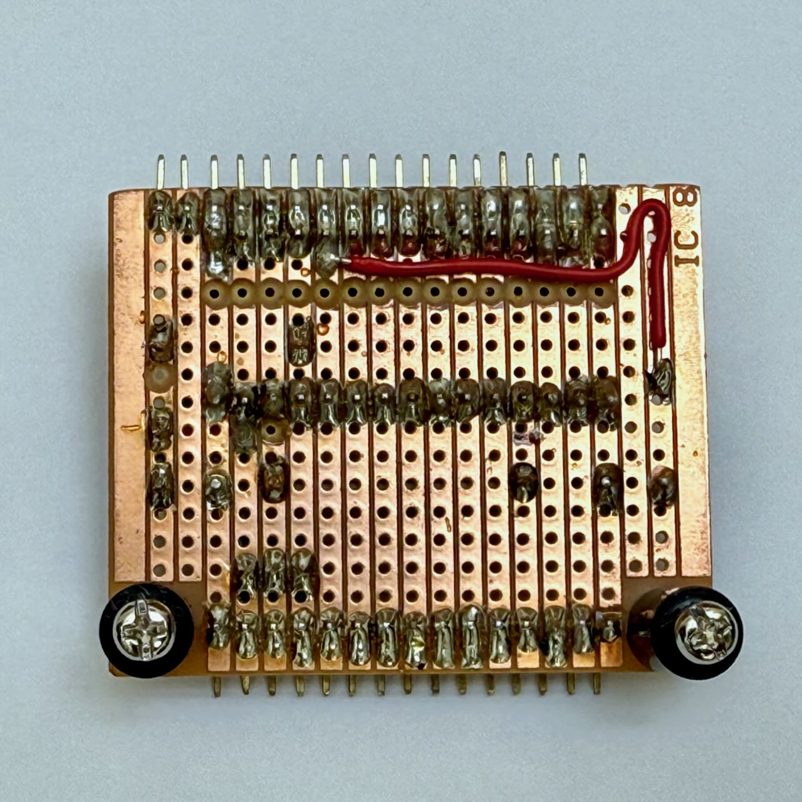
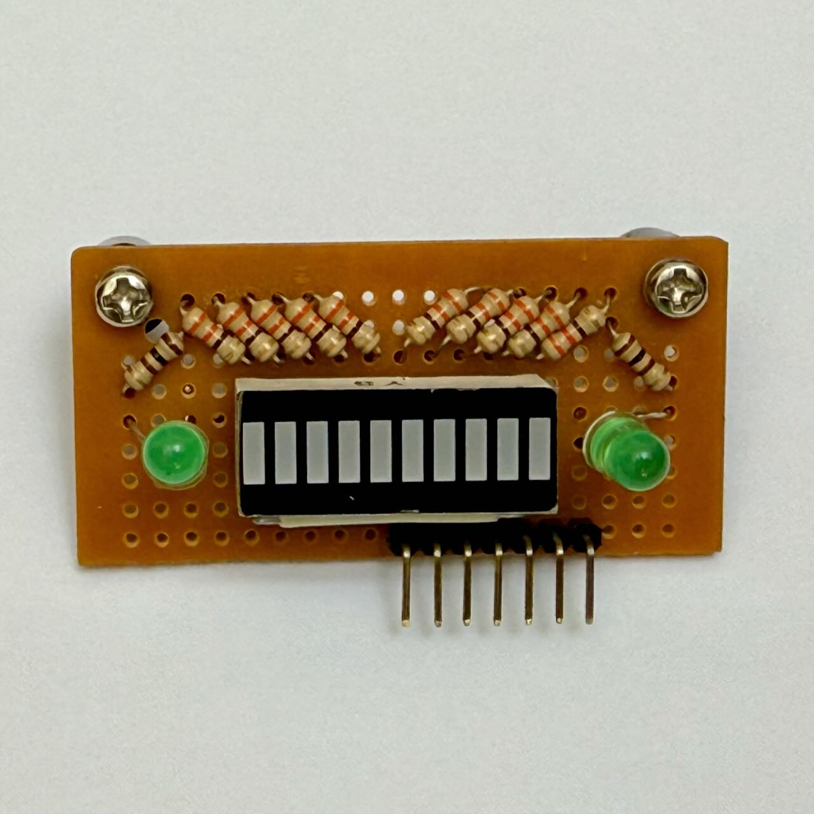
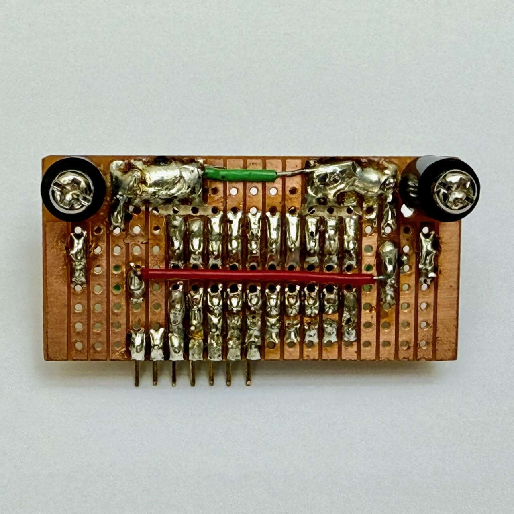

## The Problem

After I changed my car from a short Fiat 500 to a longer sedan, we had to peep over the hood and creep into the garage to be able to close the garage door. In fairness, we did get used to it pretty quickly and could park just fine, but hey, an engineer needs very little reason to work on fun weekend projects.

## The Vision

I wanted to build a bot that:

- Turns on automatically when I open the garage door
- Guides me to just the right parking distance
- Looks visually appealing and intuitive to read
- Uses minimal energy and no ugly wall warts
- Stays cheap to build

## Key Features

### Power Parasite Design

I really wanted to avoid using a wall wart. Turns out the garage door opener sends 12V DC to power the infrared safety beam sensors. Perfect! I tapped into this to power both the brains and interrupt circuitry.

### Sleepy Bot Architecture

The Arduino sleeps all day and only wakes up when the garage door opens. I use a powerful magnet on the garage door that travels past a reed switch, sending a pulse to 'Interrupt 0' (Digital Pin 2) to wake up the bot.

### PAPI-Inspired Visual Guide

This was inspired by PAPI (Precision Approach Path Indicator)—a visual aid that helps pilots maintain the correct approach to an airport. As a huge MS Flight Sim fan, I loved the simplicity and intuitive design. I used a 10-bar LED display to mimic PAPI, with green LEDs flashing when you've reached optimal distance.

### Smart Proximity Warnings

Too close to the wall? The green LEDs flash faster and faster as a warning.

### Hardware-Based Distance Adjustment

New car? Need to change the parking distance? No reprogramming needed! Just park where you want, twist a screwdriver to adjust a resistor until the green LEDs flash, and you're done.

## Hardware List

- **Arduino Nano V3 5V** - Chinese knockoff from eBay *Warning*: Uses CH340G USB chipset, required some finagling on Mac
- **Honeywell Reed Switch** - From Amazon
- **10-Bar Red LED Display**
- **Various resistors, capacitors, and connectors** - See Fritzing files for details

## Project Complexity

**Difficulty: 3/10** - Perfect weekend project that took about 4 days total to design, build, and code.

## System Design

I split the system into three separate boards for optimal placement:

- **Brains board** - Can be placed anywhere convenient
- **Visual display** - Mounted high for visibility from the car
- **Sensor board** - Positioned low, aligned with the car's front bumper

## Step 1: The Brains Board

### Schematic Design

The schematic shows all connections to the Arduino Nano. Fritzing is a fantastic tool for layout design—my final product looks almost exactly like the simulation.




## Step 2: Interrupt Circuitry

### Power and Wake-Up System

The 12V from the garage door safety beam provides perfect power. I use 2-pin jumpers to:

- Send power to the brains
- Route through the reed switch for interrupts

The board uses a diode-capacitor combination where the capacitor helps debounce the switch.


## Step 3: The Code

### Required Headers
```cpp
#include <interrupt.h>
#include <avr/io.h>
#include <avr/sleep.h>
```

### Main Functions

**setup()** - Sets pin modes

**loop()** - Does four main things:

1. **Distance Control Reading**
   ```cpp
   int sensorValue = analogRead(analogDistControl);
   int distMin = map(sensorValue, 0, 1023, 30, 100);
   ```
   Reads the variable resistor and calculates target minimum distance using `map()`. This lets me adjust the parking distance with just a screwdriver!

2. **Distance Measurement**
   ```cpp
   long distance = readDist();
   ```
   Calls `readDist()` to get current distance to the wall.

3. **LED Display Logic**
   - Max distance capped at `distMax = 250` → calls `showmax()`
   - Distance ≤ `minDist` → calls `showmin()`
   - Everything else → activates appropriate number of LEDs

4. **Sleep Management**
   Checks if it's time to sleep by comparing current `millis()` with `SLEEPDELAY`.

### Key Functions

**readDist()** - Returns average of 10 readings (configurable via `numReadings`). Max distance hard-coded to 250cm.

**showmin()** - Accepts float 'd' (ratio of distance to `distMin`). As the car gets closer beyond safe distance, 'd' gets smaller and green LEDs flash faster. Drama! 🎭

**showmax()** - Simply indicates the car is still out of range.

## Step 4: Implementation

The final system looks clean and professional. All boards are designed to be as visually appealing as possible, and I think it turned out really well!

## Get the Code

Complete project files available on GitHub:
[Arduino Park Assist Project](https://github.com/username/park-assist)

Includes:
- Working Arduino code
- Fritzing design files
- Eagle PCB files
- Assembly instructions

## Project Gallery


















