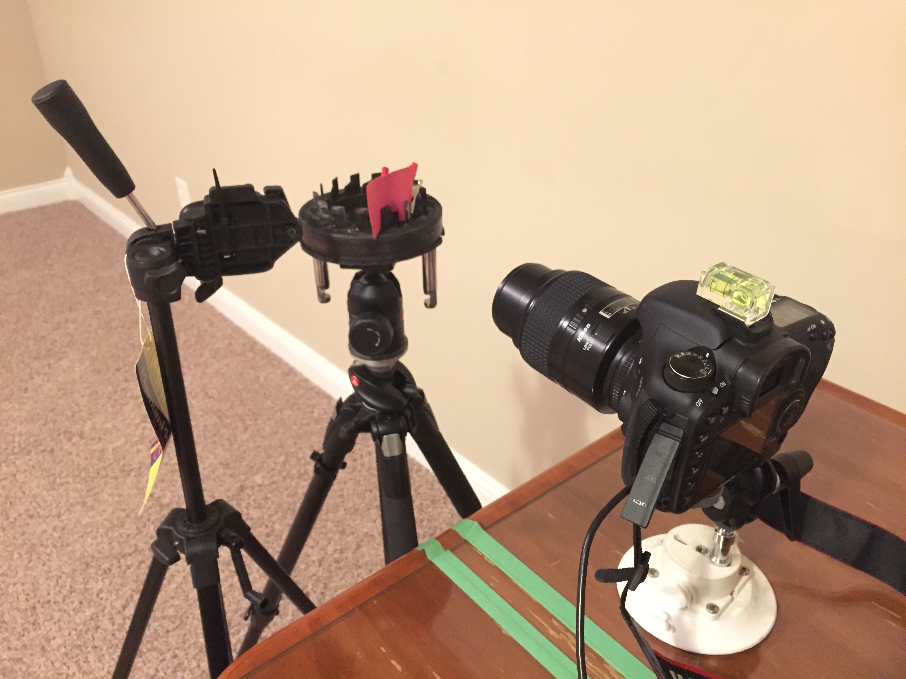
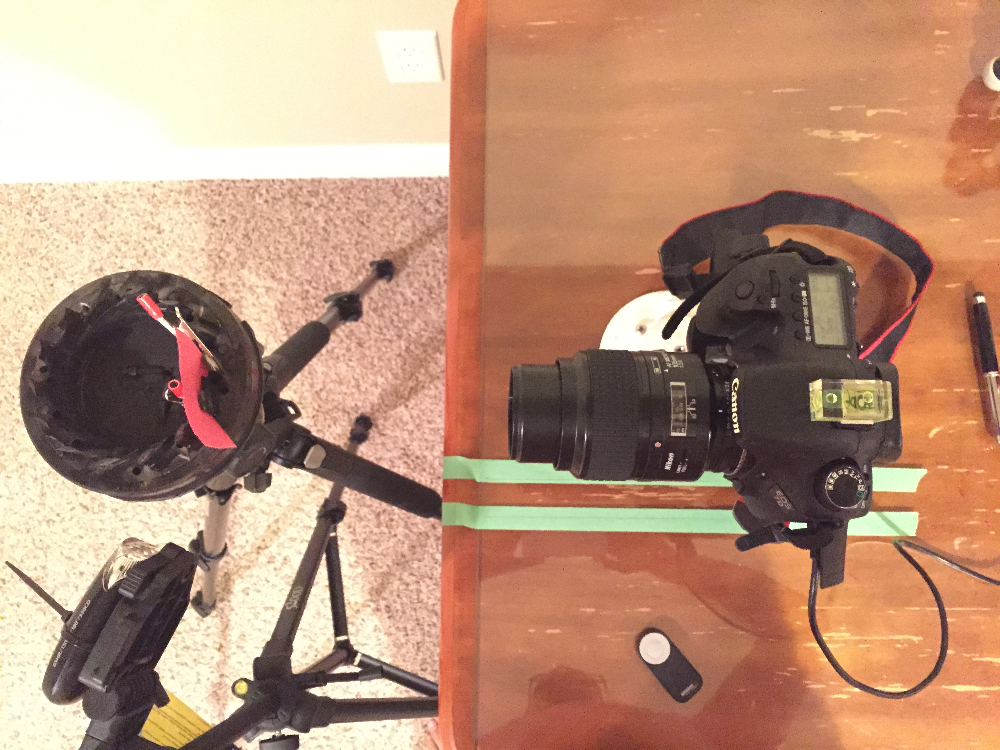
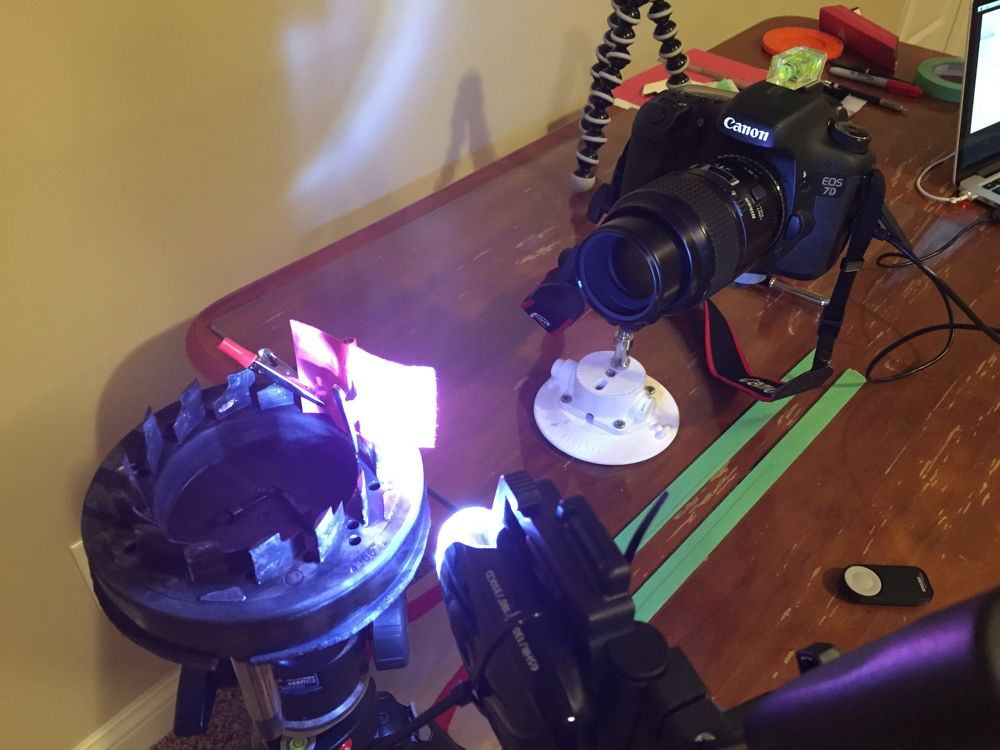
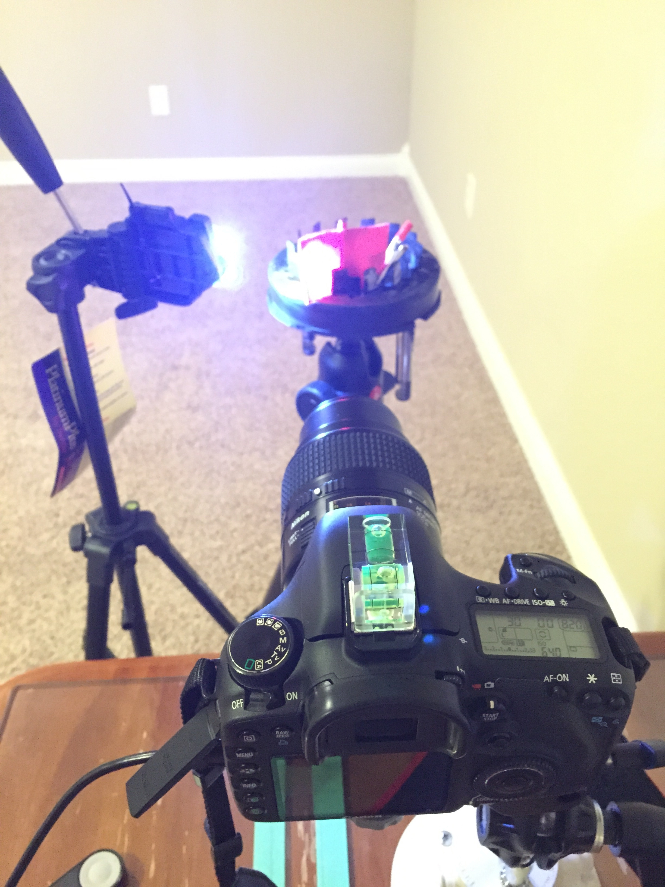
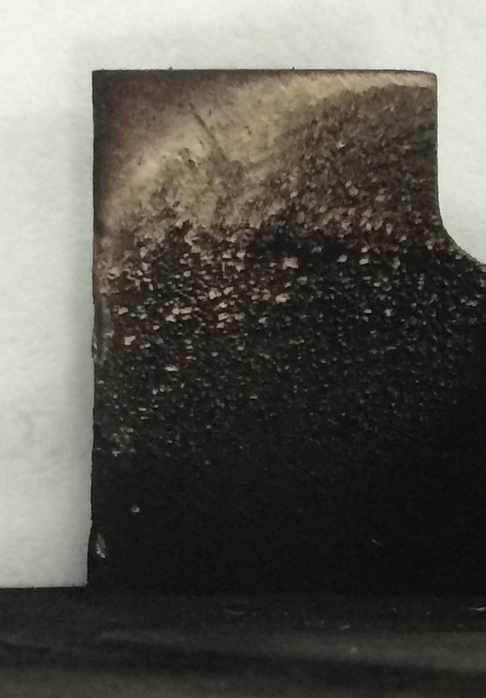
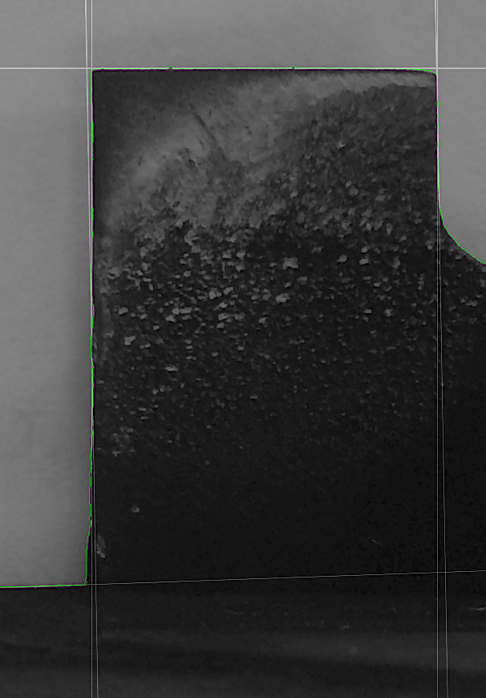
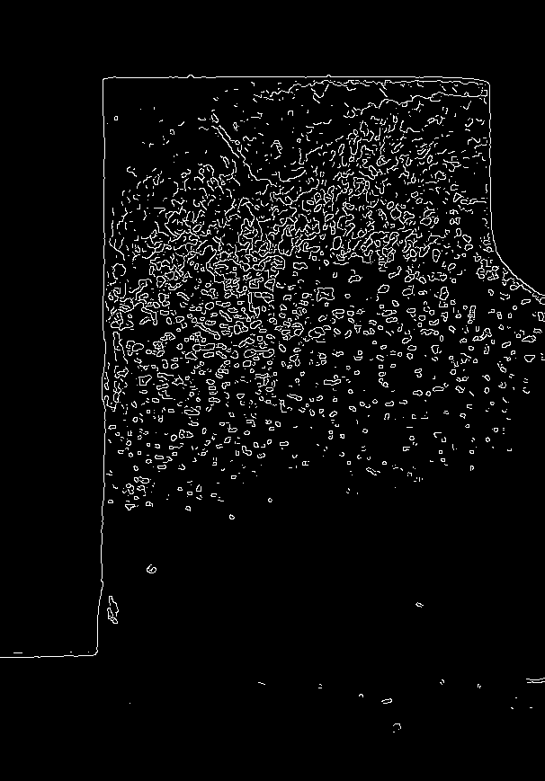
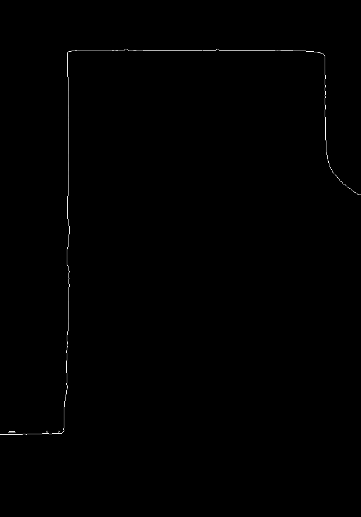
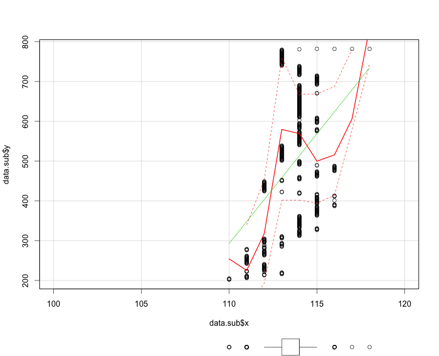

### Objective

Develop a cost-effective, automated system for quantitative analysis of turbocharger vane wear using statistical image processing techniques
### Technology Stack

The solution utilizes entirely open-source technologies:

1. **ImageMagick** - Command-line image processing and analysis [imagemagick.org](http://www.imagemagick.org/)
2. **R Statistical Computing** - Statistical analysis and data visualization [r-project.org](http://www.r-project.org/)
3. **Arduino** - Hardware control for camera positioning and indexing [arduino.cc](http://arduino.cc/)

### Test Protocol

1. **Sample Positioning**: Nozzle vane modules are mounted on a precision indexing table
2. **Camera Alignment**: Optical system positioned perpendicular to vane leading edge
3. **Automated Capture**: Indexing system rotates to capture all 14 vanes sequentially
4. **Data Processing**: R scripts execute ImageMagick routines for edge detection and statistical analysis

### Experimental Setup

#### Hardware Configuration

::: {layout-ncol=2}


{width=50% group="setup"}

{width=50% group="setup"}

{width=50% group="setup"}

{width=50% group="setup"}

:::


**Key Components:**
- Precision indexing platform with tripod-mounted head for repeatable positioning
- Canon 7D DSLR with 105mm Nikkor Macro lens (manual focus and exposure)
- Dual lighting configuration: incident window light and backlight with red filter


### Illumination Strategy

Two lighting techniques were evaluated:

1. **Incident Illumination**: Natural window light for surface detail capture
2. **Backlight Silhouette**: Red-filtered backlight creating high-contrast edge detection

The backlight technique proved superior for automated processing, generating clear silhouettes where non-vane regions appear red, facilitating precise edge detection through color channel separation.

### Image Processing Pipeline

#### Sample Analysis Workflow

::: {layout-ncol=4}

{width=25% group="vane"}

{width=25% group="vane"}

{width=25% group="vane"}

{width=25% group="vane"}

:::

```bash
# Enhance contrast for improved edge detection
convert red.jpg -contrast -contrast -contrast red.jpg

# Apply Canny edge detection algorithm
convert red.jpg -canny .001x1+16%+25% canny.jpg

# Fill and isolate edge regions
convert canny.jpg -bordercolor white -fill red -draw "color 120,1000 filltoborder" cred.png

# Generate binary edge image
convert canny.jpg -fill red -draw "color 0,0 floodfill" -alpha off -fill black +opaque red -fill white -opaque red binary.png

# Extract final edge profile
convert binary.png -background none -fill red -morphology edgein octagon:1 edge.png
convert edge.png -flip edge.png

# Export coordinate data for statistical analysis
convert canny.jpg txt:- | grep "white\|gray(255)" | sed -n 's/^\([0-9]*,[0-9]*\).*$/\1/p' > coordinates.txt

# Generate Hough line detection overlay
convert canny.jpg -background none -fill red -stroke red -strokewidth 1 -hough-lines 20x20+210 hough.jpg
convert canny.jpg hough.jpg -composite composite.jpg
```


### Results and Analysis

#### Quantitative Measurements



**Measurement Parameters:**
- **Y-Axis**: Distance from vane base to leading edge (mm)
- **X-Axis**: Deviation from nominal straight-line edge profile (μm)

The analysis reveals quantifiable deviations from the ideal vane geometry, enabling statistical characterization of wear patterns and severity assessment.

### Implementation and Source Code

Complete implementation available on GitHub: [rsangole/vanewear](https://github.com/rsangole/vanewear)

### Conclusions

This methodology demonstrates the feasibility of using open-source tools for precision measurement of mechanical component wear. The system provides:

- Automated, repeatable measurements
- Statistical quantification of wear patterns
- Cost-effective alternative to traditional metrology
- Scalable approach for production quality control

Future development could include machine learning classification of wear patterns and integration with predictive maintenance systems.
