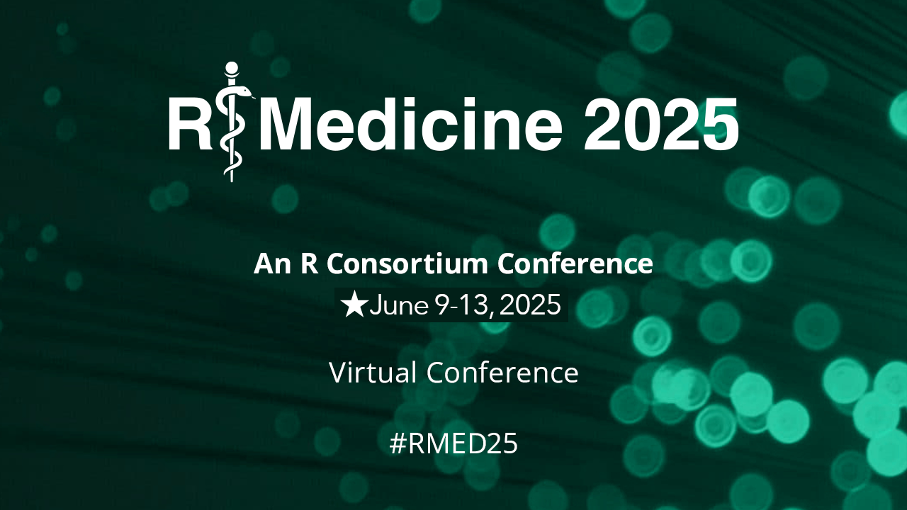

<!-- {width=300} -->



Reproducibility is a cornerstone of credible and robust data science. This workshop introduces the powerful `{targets}` package in R, which streamlines and enhances reproducibility in data science workflows. You’ll learn how to build, manage, and scale analytical pipelines that are efficient, transparent, and easy to maintain.

The `{targets}` package provides a comprehensive framework for pipeline management, enabling efficient dependency tracking, automated execution, and clear documentation of your entire analysis process. By the end of this session, you’ll be equipped to apply these tools to your own projects—from data import and cleaning, to modeling, visualization, and reporting.

---

- Slides: [https://rsangole.github.io/2025-R-Medicine_targets-workshop/presentation.html](https://rsangole.github.io/2025-R-Medicine_targets-workshop/presentation.html)

- Github: [https://github.com/rsangole/2025-R-Medicine_targets-workshop](https://github.com/rsangole/2025-R-Medicine_targets-workshop)

